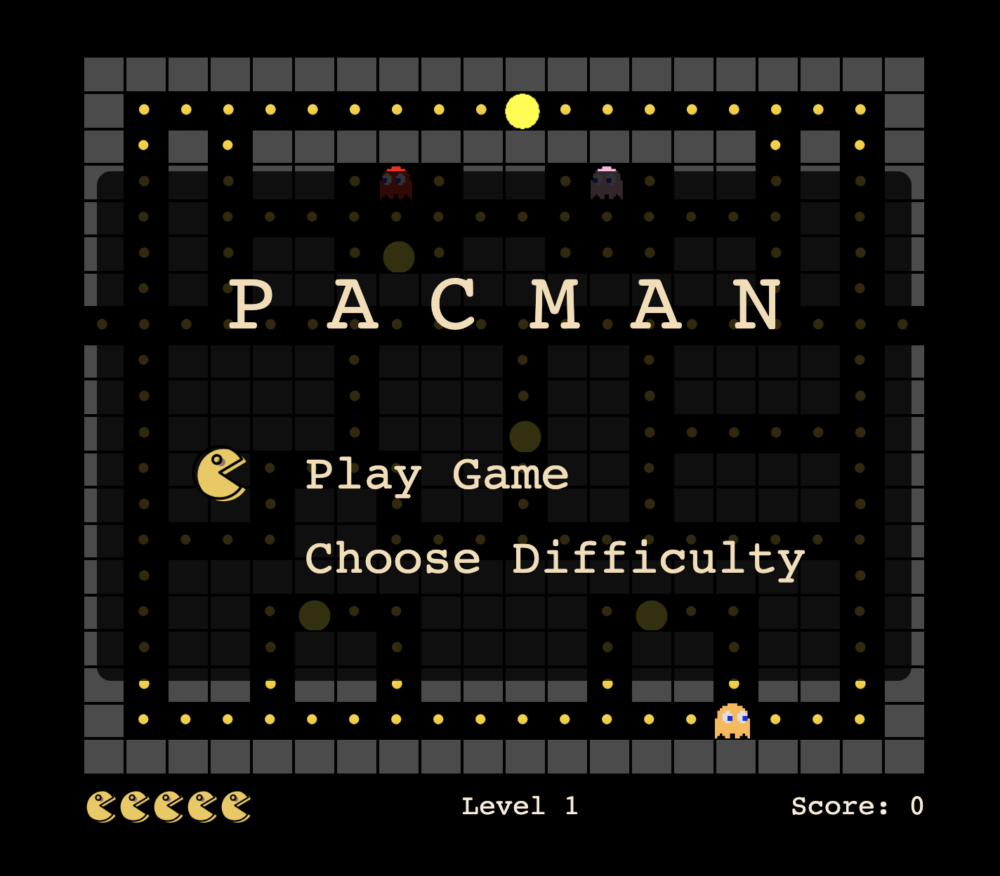

# PACMAN 

## Table of Contents
1. [ Description ](#desc)
2. [ Usage tips ](#usage)
3. [ Controls ](#controls)
4. [ Level Editor ](#level-editor)

<a name="desc"></a>
## 1. Description
This Pacman game was created using Vanilla Javascript. It's based on the original pacman and aims to deliver same sort of functionality with some additional perks. It allows you to pick multiple difficulties and goes through 3 different levels.



<a name="usage"></a>
## 2. Usage tips
There are some booleans available in the code to switch between different game modes:

1. gameMode
    * true - Play pacman
    * false - Level Editor

2. showNumbers
    * true - show grid numbers
    * false - hide grid numbers

<a name="controls"></a>
## 3. Controls
Pacman is completely a **KEYBOARD** based game. There is no mouse input involved except the level editor.

* Move Pacman - ARROW keys, M for muting sound effects
* Music Player - SPACEBAR to start/pause, N for next track

<a name="level-editor"></a>
## 4. Level Editor

Level Editor generates an array which represents the dots of the level.

To switch to level editor set `gameMode` boolean to false. It will also be useful to see the grid numbers by setting `showNumbers` to true.

Left click once to start the selecting the area you want. Left click again to stop. Double click a block to restore it.


Once finished, press Q to generate the array, which will appear in the console (CMD+SHIFT+I)

Copy this array into the code to initialise a new level class. You also need to provide an array of numbers which represent position of the pills and initial position of pacman and ghosts.

### Level Grid Class

```
class Level {
  constructor(level, dotArray, pillsArray, characterPositions){
    this.level = level 
    this.dotArray = dotArray  
    this.pillsArray = pillsArray
    this.remainingDots = dotArray.length - pillsArray.length
    this.initialPos = characterPositions
  }
}
```


